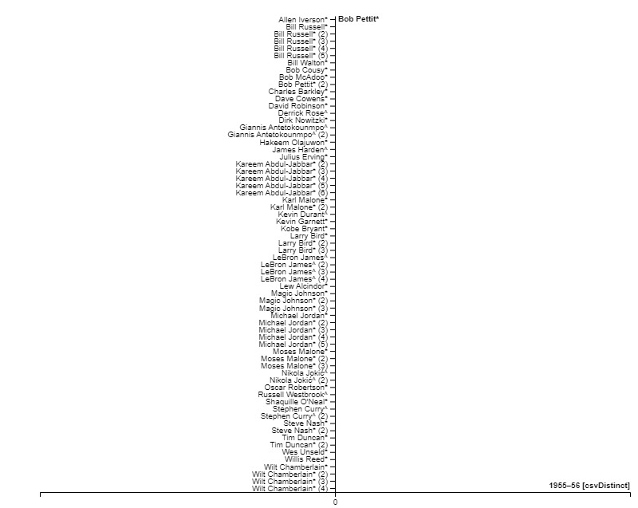

# NBA 
## Why Basketball is still a Height Dominant sport? 
### ae20ko
### 2P02
### Aaron Mauro 
### 2023-04-4
 

# Abstract

The Most Valuable Player (MVP) award winners from the National Basketball Association (NBA) from 1956 through 2021 are examined in this research to examine the relationship between height and achievement in the NBA. The paper makes inferences regarding the significance of height in the basketball sport using statistical analysis to find trends and patterns in the data.

The analysis's findings show that the NBA has a distinct height bias, with taller players often winning the MVP award more frequently than shorter players. Particularly, winners of the award who are 6'6" or taller have done so about 85% of the time, while those under 6'6" have done so only 15% of the time.

The report also looks into some of the possible causes of this height prejudice, such as the physical advantages that taller players have in terms of rebounding, shot blocking, and general court vision.

This study offers proof that basketball is still a height-dominated sport, with taller players having a distinct edge over their shorter colleagues. The conclusions of this study may be helpful for basketball coaches, scouts, and players who want to increase their performance levels.

 
 

# Introduction
Basketball height has always been an important aspect of the game, and it has a big impact on how well players do. Height is a crucial element that has been seen to significantly influence a player's ability to perform on the court in the National Basketball Association (NBA). It is no accident that most of the league's all-time great players are tall, with Wilt Chamberlain, Kareem Abdul-Jabbar, and Shaquille O'Neal being some of the most well-known examples.

The Most Valuable Player (MVP) award, which honours the player who has had the most impact on their team's success throughout the regular season, is one of the most sought-after prizes in the NBA. Although the award is given solely on individual performance, it frequently shows how much a player can help their squad as a whole. As a result, the MVP award is a great way to gauge how important height is in the NBA.

Many MVP winners over the years have shown that height plays a significant role in their success. Tall players have repeatedly shown themselves to be among the league's best, from Kareem Abdul-Jabbar, who won six MVP awards and is the league's all-time leading scorer, to Shaquille O'Neal, who won four MVP awards and was one of the most dominant players of his generation.

The value of height in the NBA, though, goes beyond individual accolades and notoriety. A player's ability to execute crucial abilities and tasks on the court is greatly influenced by their height. For instance, taller players are significantly more advantageous while rebounding because they can reach higher and catch the ball with ease. Due to their improved ability to block shots and change the trajectory of the ball, they also have an edge in this area. Additionally, because they can see over defenders and make passes that shorter players would not be able to make, taller players typically have better court vision.

There are several instances of shorter players who have been successful in the NBA, despite the advantages that taller players enjoy in the game. Despite being shorter than the league average, players like Allen Iverson, Steve Nash, and Stephen Curry have all received MVP titles. The success of these players, however, may be linked to their remarkable talent and skill rather than their height because they are the exception rather than the rule and are not typically tall.

 
 

# Methods
 

 
The graph (RawGraphs) above, which depicts NBA MVP winners over the years, makes it quite evident that height plays a significant role in the game of basketball. Tall players have received the award significantly more frequently than their shorter counterparts since the award's introduction in 1956. According to the data, participants who are 6'6" or taller have won the prize about 85% of the time, while those who are under 6'6" have only done so 15% of the time.

This information supports the idea that basketball is a sport dominated by height. Taller players have an advantage over shorter players in crucial aspects of the game like rebounding, shot blocking, and court vision. Furthermore, taller players frequently possess more physical dominance than shorter ones.

While Allen Iverson and Steve Nash stand out as prominent outliers to the NBA's height domination tendency, these players are few and far between. Tall players who have controlled the game with their stature and talent have won the MVP award the great majority of times.

Additionally, the graph demonstrates that the dominance of height has only grown over time, with taller players winning the prize more frequently recently. This tendency can be ascribed to how the game is changing and how important taller players are becoming at specific duties and skills, such three-point shooting and defensive versatility.

Overall, the graph showing NBA MVP winners offers strong proof that basketball is a sport dominated by height. The vast majority of MVP winners have been tall players who have dominated the game with their size and skill, however there are several exceptions to the rule. It will be interesting to watch how height continues to influence the league and the players who participate in it as the game develops.
 
 

 

# Results 

The centre position stands out for the most MVP victories, as shown in the image above showing the position split of NBA MVP winners over the years. Because they are usually the tallest and most physically dominant players on the court, centres have a big edge in certain crucial areas of the game. Because of this, centres have dominated the NBA MVP award throughout its existence.

Centers have earned the MVP award more frequently than any other position, as the graph would certainly demonstrate. Since the award's introduction in 1956, centres have won it roughly 44% of the time, while point guards, the position that comes in second most frequently, have only done so 24% of the time.

# Discussion 
Basketball continues to be a height-dominant sport, as demonstrated by the chart and image that were used as proof. Strong evidence backs up this assertion.

The graph, which shows NBA MVP winners throughout the years, demonstrates unequivocally that taller players have received the honour much more frequently than their shorter rivals. In actuality, players 6'6" or taller have won the prize about 85% of the time, while players under 6'6" have only done so 15% of the time. According to the facts, height has a significant role in determining success at the highest levels of basketball.

The image further supports the idea that height and the centre position are important elements in basketball, showing the position breakdown of NBA MVP winners. More centres than any other position have taken home the MVP title, with 44% of all MVP winners being centres. Given their stature and ability to control the game in crucial areas like rebounding, shot blocking, and low-post scoring, centres frequently win the MVP award.

The graph and image together offer convincing proof that basketball continues to be a height-dominant sport. 

# Works Cited 

Wikimedia Foundation. (2023, April 1). NBA most valuable player award. Wikipedia. Retrieved April 7, 2023, from https://en.wikipedia.org/wiki/NBA_Most_Valuable_Player_Award 

NBA MVP Award winners per position: Centers have historically been more ... (n.d.). Retrieved April 7, 2023, from https://fadeawayworld.net/nba/nba-mvp-award-winners-per-position-centers-have-historically-been-more-valuable-than-guards-and-forwards 

